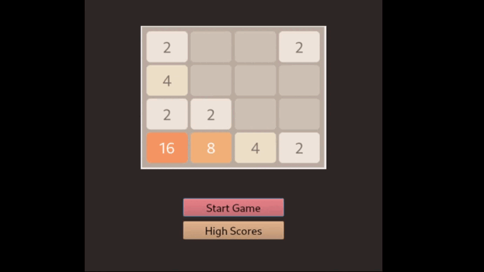
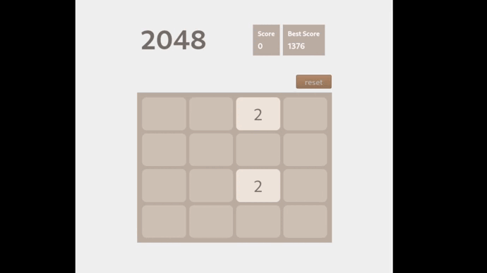

<div id="top"></div>


<!-- PROJECT LOGO -->
<br />
<div align="center">
       
    <h2 align="center">The 2048 Game</h2>
    <h3 align="center">Final projects</h3>
</div>

<!-- TABLE OF CONTENTS -->

  <summary>Table of Contents</summary>
  <ol>      
      <a href="#about-the-project">About The Project</a>         
  </ol>


<!-- ABOUT THE PROJECT -->
# About The Project
This is an example of how you may give instructions on setting up your project locally.
To get a local copy up and running follow these simple example steps.

1. [**How to install Qt**](https://anassbelcaid.github.io/CS221/qtcreator/)
2. **Clone the repo**
   ```sh
   git clone https://github.com/IlyasKadi/2048-Game.git
   ```
 
<p align="right">(<a href="#top">back to top</a>)</p>

<div align="center">
      
    <h5><font color='gris'>tutorial for The 2048 Game</font></h5>
</div>

<div align="center">
       
    <h5><font color='gris'>tutorial for reset</font></h5>
</div>
 
```cpp 
//Forming a random position
std::pair<int, int> NumsGame::formrandpos()
{
    int randi = rand() % 4;
    int randj = rand() % 4;
     return std::make_pair(randj, randi);
}

//Setting up two first tiles to start with
void NumsGame::setinitialpos()
{
        auto [rndi,rndj]=formrandpos();
        auto [rndi_,rndj_]=formrandpos();


      numsMatrix[rndi][rndj]=2;
      numsMatrix[rndi_][rndj_]=2;

     ui->gridboard->addWidget(settile(2),rndi,rndi);
     ui->gridboard->addWidget(settile(2),rndi_,rndj_);
}
```
```cpp 
void NumsGame::keyPressEvent(QKeyEvent *event)
{
    switch (event->key())
    {
          case Qt::Key_Up:
         {
            moveUp();
            ui->resetbutton->setEnabled(1);
            break;
         }
         case Qt::Key_Left:
        {
            moveLeft();
            ui->resetbutton->setEnabled(1);
            break;
        }
         case Qt::Key_Right:
        {
            moveRight();
            ui->resetbutton->setEnabled(1);
            break;
        }
         case Qt::Key_Down:
        {
            moveDown();
            ui->resetbutton->setEnabled(1);
            break;
        }
   }
}
``` 


```cpp
void NumsGame::gameOver()
{
    ui->Tryagain->setEnabled(1);
    ui->gameoverlabel->show();
    ui->Tryagain->show();
    ui->lastScore->setText(QString::number(score));
    ui->lastScore->show();
    ui->youreScore->show();
    ui->nicknamelabel->show();
    ui->Nickname->show();
    ui->submit->show();
}
```

```cpp
void NumsGame::winner()
{
    ui->newGame->setEnabled(1);
    ui->Quit->setEnabled(1);
    ui->Quit->show();
    ui->winner->show();
    ui->newGame->show();
    ui->Quit->show();
    ui->lastScore->setText(QString::number(score));
    ui->lastScore->show();
    ui->youreScore->show();
    ui->nicknamelabel->show();
    ui->Nickname->show();
    ui->submit->show();
}
```
```cpp
void NumsGame::moveUp()
{
    oladboard=numsMatrix;


    //this is a space remover phase

    for (int j = 0; j < 4; j++)
    {
        for (int i = 1; i < 4; i++)
        {
                 if (numsMatrix[i][j] != 0)
                {
                     for(int k=0;k<i;k++)
                     {
                       if (numsMatrix[k][j] == 0)
                      {
                        numsMatrix[k][j]=numsMatrix[i][j];
                        numsMatrix[i][j]=0;
                      }
                  }
             }
        }
    }

 //this is the sum phase (and so on concerning other dorections)
    for (int j = 0; j < 4; j++)
      {
      for (int i = 1; i < 4; i++)
        {
         if (numsMatrix[i][j] != 0)
          {
          if(numsMatrix[i-1][j] == numsMatrix[i][j] )
           {
             numsMatrix[i-1][j]=numsMatrix[i][j]*2;
             ScoreAddedSayHi( numsMatrix[i-1][j]);
             score+=numsMatrix[i-1][j];
             numsMatrix[i][j]=0;
           }
         }
       }
     }
    //this is another space remover phase (and the same for other dorections)

    for (int j = 0; j < 4; j++)
      {
      for (int i = 1; i < 4; i++)
        {
        if (numsMatrix[i][j] != 0)
         {
         for(int k=0;k<i;k++)
           {
           if (numsMatrix[k][j] == 0)
            {
               numsMatrix[k][j]=numsMatrix[i][j];
               numsMatrix[i][j]=0;
            }
           }
         }
        }
      }
      putOnnums();
      move_or_die();
}
```

```cpp
void NumsGame::moveDown()
{
    oladboard=numsMatrix;

    for(int j=0;j<4;j++)
    {
        for(int i=2;i>=0;i--)
        {
            if(numsMatrix[i][j]!=0)
            {
                for(int k=3;k>i;k--)
                {
                    if(numsMatrix[k][j]==0)
                    {
                        numsMatrix[k][j]=numsMatrix[i][j];
                        numsMatrix[i][j]=0;
                    }
                }
            }
        }
    }

    for(int j=0;j<4;j++)
    {
        for(int i=2;i>=0;i--)
        {
            if(numsMatrix[i][j]!=0)
            {
               if(numsMatrix[i+1][j]==numsMatrix[i][j])
                {
                   numsMatrix[i+1][j]=numsMatrix[i][j]*2;
                   ScoreAddedSayHi(numsMatrix[i+1][j]);
                   score+=numsMatrix[i+1][j];
                   numsMatrix[i][j]=0;
                }
           }
        }
     }

    for(int j=0;j<4;j++)
    {
        for(int i=2;i>=0;i--)
        {
            if(numsMatrix[i][j]!=0)
            {
                for(int k=3;k>i;k--)
                {
                    if(numsMatrix[k][j]==0)
                    {
                        numsMatrix[k][j]=numsMatrix[i][j];
                        numsMatrix[i][j]=0;
                    }
                }
            }
        }
    }
    putOnnums();
    move_or_die();
}
```

```cpp
void NumsGame::moveRight()
{
   oladboard=numsMatrix;
    for(int i=0;i<4;i++)
    {
        for(int j=2;j>=0;j--)
        {
            if(numsMatrix[i][j]!=0)
            {
               for(int k=3;k>j;k--)
                {
                    if(numsMatrix[i][k]==0)
                    {
                        numsMatrix[i][k]=numsMatrix[i][j];
                        numsMatrix[i][j]=0;
                    }
                }
            }
        }
    }

    for(int i=0;i<4;i++)
    {
        for(int j=2;j>=0;j--)
        {
            if(numsMatrix[i][j]!=0)
            {
               if(numsMatrix[i][j+1]==numsMatrix[i][j] )
               {
                   numsMatrix[i][j+1]=numsMatrix[i][j]*2;
                   ScoreAddedSayHi( numsMatrix[i][j+1]);
                   score+=numsMatrix[i][j+1];
                   numsMatrix[i][j]=0;
               }
            }
        }
    }

    for(int i=0;i<4;i++)
    {
        for(int j=2;j>=0;j--)
        {
            if(numsMatrix[i][j]!=0)
            {
                for(int k=3;k>j;k--)
                {
                    if(numsMatrix[i][k]==0)
                    {
                        numsMatrix[i][k]=numsMatrix[i][j];
                        numsMatrix[i][j]=0;
                    }
                }
            }
        }
    }
    putOnnums();
    move_or_die();
}
```

```cpp
void NumsGame::moveLeft()
{
    oladboard=numsMatrix;

    for(int i=0;i<4;i++)
    {
        for(int j=1;j<4;j++)
        {
            if(numsMatrix[i][j]!=0)
            {
                for(int k=0;k<j;k++)
                {
                    if(numsMatrix[i][k]==0)
                    {
                        numsMatrix[i][k]=numsMatrix[i][j];
                        numsMatrix[i][j]=0;
                    }
                }
            }
        }
    }

    for(int i=0;i<4;i++)
    {
        for(int j=1;j<4;j++)
        {
            if(numsMatrix[i][j]!=0)
            {
                if(numsMatrix[i][j-1]==numsMatrix[i][j] )
                {
                    numsMatrix[i][j-1]=numsMatrix[i][j]*2;
                    ScoreAddedSayHi( numsMatrix[i][j-1]);
                    score+=numsMatrix[i][j-1];
                    numsMatrix[i][j]=0;
                }
            }
        }
    }

    for(int i=0;i<4;i++)
    {
        for(int j=1;j<4;j++)
        {
            if(numsMatrix[i][j]==0)
            {
                for(int k=0;k<j;k++)
                {
                    if(numsMatrix[i][k]==0)
                    {
                        numsMatrix[i][k]=numsMatrix[i][j];
                        numsMatrix[i][j]=0;
                    }
                }
            }
        }
    }
    putOnnums();
    move_or_die();
}
``` 

```cpp
void NumsGame::putOnnums()
{

    for(int i=0; i<4 ;i++)
    {
        for(int j=0; j<4 ;j++)
        {
            ui->gridboard->addWidget(settile(0),i,j);
        }
    }

    for(int i=0; i<4 ;i++)
    {
        for(int j=0; j<4 ;j++)
        {
            if(numsMatrix[i][j]!=0)
            ui->gridboard->addWidget(settile(numsMatrix[i][j]),i,j);
        }
    }
}
```
-------------------------------------------------------------------------------------------------------------------------------------------------------------------
 Our Team     : [AIT EL KADI Ilyas](https://github.com/IlyasKadi) - [AZIZ Oussama](https://github.com/ATAMAN0)  
 
   Project Link : [The 2048 Game](https://github.com/IlyasKadi/2048-Game)   
 
  > Encadré par  : [Mr.BELCAID-Anass](https://anassbelcaid.github.io)  
                                                                                             
<p align="right">(<a href="#top">back to top</a>)</p>
