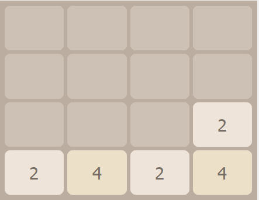

<div id="top"></div>


<!-- PROJECT LOGO -->
<br />
<div align="center">
       
    <h2 align="center">The 2048 Game</h2>
    <h3 align="center">Final projects</h3>
</div>

<!-- TABLE OF CONTENTS -->

  <summary>Table of Contents</summary>
  <ol>      
      <a href="#about-the-project">About The Project</a>         
  </ol>
  <ol>
    <li>
      <a href="#Part-I">Part I :Graphical part</a>
         <ul>
              <li><a href="#Welcome-interface">Welcome interface</a></li>
              <li><a href="#Main-Game">Main Game interface</a></li>
              <li><a href="#High-Scores">High Scores interface</a></li>
           </ul>
    </li>
        <li>
            <a href="#Part-II">Part II : Core of the game (algorithm)</a>
            <ul> 
              <li><a href="#Movements">Movements</a></li>
              <li><a href="#Winner-Loser">Win/Lose logic</a></li>
              <li><a href="#Scoring">Scoring</a></li>
            </ul>
           </li> 
        <li><a href="#Part-III">Part III :MVC + database Implementation </a></li>
   </ol>


<!-- ABOUT THE PROJECT -->
# About The Project
This is an example of how you may give instructions on setting up your project locally.
To get a local copy up and running follow these simple example steps.

1. [**How to install Qt**](https://anassbelcaid.github.io/CS221/qtcreator/)
2. **Clone the repo**
   ```sh
   git clone https://github.com/IlyasKadi/2048-Game.git
   ```
 
<p align="right">(<a href="#top">back to top</a>)</p>

<div align="center">
      
    <h5><font color='gris'>overview of The 2048 Game</font></h5>
</div>

<div align="center">
       
    <h5><font color='gris'>overview of reset</font></h5>
</div>


# Part-I 

In this part we worked mostly with ui to design the form of the parts of te GAME.

## Welcome-interface

<div align="center">
       
    
</div>


So basically there is a simple image of the game and two buttons one to launch a new game and the second one for checking scores
So when clicking first button it will leads you to :


## Main-Game


<div align="center">
       
    
</div>

This is our main game interface we decided to keep it as much classic and minimalist as possible one label for 2048 and two others one for best score and the other for the realtime score and a button to reset in case you get bored or you don't like your progess .


The idea id to work with a 4*4 matrix to store the values of the board and corresponding each number 2,4,8..2048 to a tile (label well designed)

This is the code part that made that first look

>Those are the main function used in the main game view

```cpp
settile(int numberintile);
putOnnums();
setMainBorder();
setinitialpos();

```

```cpp
//Design of tile based on each number
QLabel * NumsGame:: settile(int numberintile)
{

       QString labelNum = QString::number(numberintile);
       QLabel *tile = new QLabel(labelNum);
       tile->setAlignment(Qt::AlignCenter);


        switch (numberintile) {
        case 2: {

            tile->setStyleSheet("background: rgb(238,228,218);" "color: rgb(119,110,101);" "font: bold; border-radius: 10px; font: 22pt;");

            break;
        }
        case 4: {
           tile->setStyleSheet("background: rgb(237,224,200);" "color: rgb(119,110,101);" "font: bold; border-radius: 10px; font: 22pt;");
            break;
        }
        case 8: {
           tile->setStyleSheet("background: rgb(242,177,121);" "color: rgb(255,255,255);" "font: bold; border-radius: 10px; font: 22pt;");
            break;
        }
        case 16: {
            tile->setStyleSheet("background: rgb(245,150,100);" "color: rgb(255,255,255);" "font: bold; border-radius: 10px; font: 22pt;");
            break;
        }
        case 32: {
            tile->setStyleSheet("background: rgb(245,125,95);" "color: rgb(255,255,255);" "font: bold; border-radius: 10px; font: 22pt;");
            break;
        }
        case 64: {
            tile->setStyleSheet("background: rgb(245,95,60);" "color: rgb(255,255,255);" "font: bold; border-radius: 10px; font: 22pt;");
            break;
        }
        case 128: {
            tile->setStyleSheet("background: rgb(237,207,114);" "color: rgb(255,255,255);" "font: bold;" "border-radius: 10px; font: 22pt;");
            break;
        }
        case 256: {
            tile->setStyleSheet("background: rgb(237,204,97);" "color: rgb(255,255,255);" "font: bold; border-radius: 10px; font: 22pt;");
            break;
        }
        case 512: {
            tile->setStyleSheet("background: rgb(237,204,97);" "color: rgb(255,255,255);" "font: bold; border-radius: 10px; font: 22pt;");
            break;
        }
        case 1024: {
            tile->setStyleSheet("background: rgb(237,204,97);" "color: rgb(255,255,255);" "font: bold; border-radius: 10px; font: 22pt;");
            break;
        }
        case 2048: {
            QGraphicsDropShadowEffect *dse = new QGraphicsDropShadowEffect();
            dse->setColor(Qt::yellow);
            dse->setBlurRadius(50);
            dse->setOffset(-1);
            tile->setGraphicsEffect(dse);
            tile->setStyleSheet("background: rgb(237,204,97);"  "color: rgb(255,255,255); font: bold;" "border-radius: 10px; font: 22pt;");
            break;
        }
        default: {
             tile = new QLabel();
            tile->setStyleSheet("background: rgb(205,192,180);" "border-radius: 10px;" "color: rgb(119,110,101);");


            break;
        }

}
return tile;


}
```
```cpp
//Corresponding each num with its tile designed
void NumsGame::putOnnums()
{

//clear all
    for(int i=0; i<4 ;i++)
    {
        for(int j=0; j<4 ;j++)
        {
            ui->gridboard->addWidget(settile(0),i,j);
        }
    }

//Put on tiles
    for(int i=0; i<4 ;i++)
    {
        for(int j=0; j<4 ;j++)
        {
            if(numsMatrix[i][j]!=0)
            ui->gridboard->addWidget(settile(numsMatrix[i][j]),i,j);
        }
    }

}
```

```cpp
///Setting up base view
void NumsGame::setMainBorder()
{

    //initializing board (matrix 4*4)
    numsMatrix.resize(4);
    for (int i = 0; i < 4; i++)
        numsMatrix[i].resize(4);
    for (int i = 0; i < 4; i++)
         for (int j = 0; j < 4;j++)
            numsMatrix[i][j]=0;

    ui->gameoverlabel->hide();
    ui->winner->hide();
    ui->Tryagain->hide();
    ui->newGame->hide();
    ui->Quit->hide();
    ui->lastScore->hide();
    ui->youreScore->hide();
    ui->nicknamelabel->hide();
    ui->Nickname->hide();
    ui->submit->hide();

for (int i = 0; i < 4; ++i) {
   for (int j = 0; j < 4; ++j) {

        QLabel *label = new QLabel();

         label->setStyleSheet("background: rgb(205,192,180);" "border-radius: 10px;" "color: rgb(119,110,101);" );

         label->setAlignment(Qt::AlignCenter);
         ui->gridboard->addWidget(label,i,j);

   }

}
 setinitialpos();
}
```

```cpp
//Forming a random position
std::pair<int, int> NumsGame::formrandpos()
{
    int randi = rand() % 4;
    int randj = rand() % 4;
     return std::make_pair(randj, randi);
}

//Setting up two first tiles to start with
void NumsGame::setinitialpos()
{
        auto [rndi,rndj]=formrandpos();
        auto [rndi_,rndj_]=formrandpos();


      numsMatrix[rndi][rndj]=2;
      numsMatrix[rndi_][rndj_]=2;

     ui->gridboard->addWidget(settile(2),rndi,rndi);
     ui->gridboard->addWidget(settile(2),rndi_,rndj_);


}

```

```cpp
void NumsGame::start()
{
    this->setFixedSize(this->geometry().width(),this->geometry().height());
    getbestscore();
    setMainBorder();

}
```


otherwise if you clicked second button it will leads you to :


## High-Scores
<div align="center">
       
    
</div>

This is the High Scores interface two simples labels one for Nickname and the other for High Scores and a list view where we going to put our model.


<br>

# Part-II

And for the main meal there is a lot to talk about ..,  we tried to implement our own algorithm in the game (and by the way Oussama used to play the GAME a lot) that's why we decided to keep it as first choice instead of working on another game.

So first things first :

## Movements
We made an easy movement logic that is divided into three phases (for each movement in a certain direction) :

Remove Extra Spaces
<br>
Perform The Sum
<br>
Remove Extra Spaces 
<br>

Here is a Simple schema that explain how it really works within an exemple of moving up :
> Same thing for other movement you just need to play a bit with indexes

<br>
<br>
A first case when spaces needed to be removed first 
<div align="center">
       
     <h5  align="center"><font color='white'>overview of reset</font></h5>
    
</div>

<br>
<br>
<br>
<br>
A first case when spaces needed to be removed after the sum 
<div align="center">
       
     <h5  align="center"><font color='white'>overview of reset</font></h5>
    
</div>

<br>
<br>
<br>
<br>

And for the coding part :

<table>
<tr>
    <td align="center"><br /><sub>
        move up
   </sub></a><br /></td>

   <td align="center"><br /><sub>  
       move down
   </sub></a><br /></td>
</tr> 

  <tr>
    <td ><br /><sub>

```cpp
void NumsGame::moveUp()
{
    oladboard=numsMatrix;
    //this is a space remover phase

    for (int j = 0; j < 4; j++)
    {
        for (int i = 1; i < 4; i++)
        {
                 if (numsMatrix[i][j] != 0)
                {
                     for(int k=0;k<i;k++)
                     {
                       if (numsMatrix[k][j] == 0)
                      {
                        numsMatrix[k][j]=numsMatrix[i][j];
                        numsMatrix[i][j]=0;
                      }
                  }
             }
        }
    }

 //this is the sum phase (and so on concerning other dorections)
    for (int j = 0; j < 4; j++)
      {
      for (int i = 1; i < 4; i++)
        {
         if (numsMatrix[i][j] != 0)
          {
          if(numsMatrix[i-1][j] == numsMatrix[i][j] )
           {
             numsMatrix[i-1][j]=numsMatrix[i][j]*2;
             ScoreAddedSayHi( numsMatrix[i-1][j]);
             score+=numsMatrix[i-1][j];
             numsMatrix[i][j]=0;
           }
         }
       }
     }
    //this is another space remover phase (and the same for other dorections)

    for (int j = 0; j < 4; j++)
      {
      for (int i = 1; i < 4; i++)
        {
        if (numsMatrix[i][j] != 0)
         {
         for(int k=0;k<i;k++)
           {
           if (numsMatrix[k][j] == 0)
            {
               numsMatrix[k][j]=numsMatrix[i][j];
               numsMatrix[i][j]=0;
            }
           }
         }
        }
      }
      putOnnums();
      move_or_die();
}
```
        
</sub></a><br /></td>

<td ><br /><sub>  
    
```cpp
void NumsGame::moveDown()
{
    oladboard=numsMatrix;

    for(int j=0;j<4;j++)
    {
        for(int i=2;i>=0;i--)
        {
            if(numsMatrix[i][j]!=0)
            {
                for(int k=3;k>i;k--)
                {
                    if(numsMatrix[k][j]==0)
                    {
                        numsMatrix[k][j]=numsMatrix[i][j];
                        numsMatrix[i][j]=0;
                    }
                }
            }
        }
    }

    for(int j=0;j<4;j++)
    {
        for(int i=2;i>=0;i--)
        {
            if(numsMatrix[i][j]!=0)
            {
               if(numsMatrix[i+1][j]==numsMatrix[i][j])
                {
                   numsMatrix[i+1][j]=numsMatrix[i][j]*2;
                   ScoreAddedSayHi(numsMatrix[i+1][j]);
                   score+=numsMatrix[i+1][j];
                   numsMatrix[i][j]=0;
                }
           }
        }
     }

    for(int j=0;j<4;j++)
    {
        for(int i=2;i>=0;i--)
        {
            if(numsMatrix[i][j]!=0)
            {
                for(int k=3;k>i;k--)
                {
                    if(numsMatrix[k][j]==0)
                    {
                        numsMatrix[k][j]=numsMatrix[i][j];
                        numsMatrix[i][j]=0;
                    }
                }
            }
        }
    }
    putOnnums();
    move_or_die();
}
```   
</sub><br /></td></tr>   


<tr>
    <td align="center"><br /><sub>
        move Right
   </sub></a><br /></td>

   <td align="center"><br /><sub>  
       move left
   </sub></a><br /></td>
</tr> 

  <tr>
    <td ><br /><sub>

```cpp
void NumsGame::moveRight()
{
   oladboard=numsMatrix;
    for(int i=0;i<4;i++)
    {
        for(int j=2;j>=0;j--)
        {
            if(numsMatrix[i][j]!=0)
            {
               for(int k=3;k>j;k--)
                {
                    if(numsMatrix[i][k]==0)
                    {
                        numsMatrix[i][k]=numsMatrix[i][j];
                        numsMatrix[i][j]=0;
                    }
                }
            }
        }
    }

    for(int i=0;i<4;i++)
    {
        for(int j=2;j>=0;j--)
        {
            if(numsMatrix[i][j]!=0)
            {
               if(numsMatrix[i][j+1]==numsMatrix[i][j] )
               {
                   numsMatrix[i][j+1]=numsMatrix[i][j]*2;
                   ScoreAddedSayHi( numsMatrix[i][j+1]);
                   score+=numsMatrix[i][j+1];
                   numsMatrix[i][j]=0;
               }
            }
        }
    }

    for(int i=0;i<4;i++)
    {
        for(int j=2;j>=0;j--)
        {
            if(numsMatrix[i][j]!=0)
            {
                for(int k=3;k>j;k--)
                {
                    if(numsMatrix[i][k]==0)
                    {
                        numsMatrix[i][k]=numsMatrix[i][j];
                        numsMatrix[i][j]=0;
                    }
                }
            }
        }
    }
    putOnnums();
    move_or_die();
}
```
        
</sub></a><br /></td>

<td ><br /><sub>  
    


```cpp
void NumsGame::moveLeft()
{
    oladboard=numsMatrix;

    for(int i=0;i<4;i++)
    {
        for(int j=1;j<4;j++)
        {
            if(numsMatrix[i][j]!=0)
            {
                for(int k=0;k<j;k++)
                {
                    if(numsMatrix[i][k]==0)
                    {
                        numsMatrix[i][k]=numsMatrix[i][j];
                        numsMatrix[i][j]=0;
                    }
                }
            }
        }
    }

    for(int i=0;i<4;i++)
    {
        for(int j=1;j<4;j++)
        {
            if(numsMatrix[i][j]!=0)
            {
                if(numsMatrix[i][j-1]==numsMatrix[i][j] )
                {
                    numsMatrix[i][j-1]=numsMatrix[i][j]*2;
                    ScoreAddedSayHi( numsMatrix[i][j-1]);
                    score+=numsMatrix[i][j-1];
                    numsMatrix[i][j]=0;
                }
            }
        }
    }

    for(int i=0;i<4;i++)
    {
        for(int j=1;j<4;j++)
        {
            if(numsMatrix[i][j]==0)
            {
                for(int k=0;k<j;k++)
                {
                    if(numsMatrix[i][k]==0)
                    {
                        numsMatrix[i][k]=numsMatrix[i][j];
                        numsMatrix[i][j]=0;
                    }
                }
            }
        }
    }
    putOnnums();
    move_or_die();
}
``` 
  
</sub><br /></td></tr>   
</table>

And this is the link between movement and keyboard keys :
`dontmove` is a variable that allows player to move as long as he can move You didn't finish yet (neither a winner or loser)

```cpp 
void NumsGame::keyPressEvent(QKeyEvent *event)
{
    switch (event->key())
   {
        if(dontmove==0)
       {
            case Qt::Key_Up:
           {
                moveUp();
                ui->resetbutton->setEnabled(1);
                break;
           }
           case Qt::Key_Left:
           {
                moveLeft();
                ui->resetbutton->setEnabled(1);
                break;

            }
            case Qt::Key_Right:
           {
                moveRight();
                ui->resetbutton->setEnabled(1);
                break;

           }
            case Qt::Key_Down:
           {
                moveDown();
                ui->resetbutton->setEnabled(1);
                break;
           }
       }

   }
}
``` 

This is a special part of  `move_or_die` function that decide if a new tile is going to be created after an attempt to move to a certain direction so that player can move ( before winning or losing the game ) if yes it creates a new tile in a random place.

So basically it compare between two matrices the old one before pressing a key (in an direction) and the new one after pressing THE SAME KEY so if there is no change in THE MATRIX you can't have a new tile while you keep pressing trying to go in that same direction otherwise you can easaly win..-_-..

> This is an example where you can't move down anymore

<div align="center">
       
    
</div>

```cpp

   //condition that check if next move is possible :
    if( oladboard!=numsMatrix) //movement possible
    {
       //updating score:
        ui->Score_N->setText(QString::number(score));
        if(ui->BEST_SCORE_N->text().toInt()<=score)
        {
            bscore=score;
             ui->BEST_SCORE_N->setText(QString::number(score));
        }


        //making a rand free position
        std:: pair<int, int> randpos =formrandpos();
        do {
            randpos =formrandpos();

        } while (numsMatrix[randpos.first][randpos.second] != 0);


        //to add a new tile in it:
        numsMatrix[randpos.first][randpos.second]=2 ;
        ui->gridboard->addWidget(settile(2),randpos.first,randpos.second);

    }

    
```


## Winner-Loser

> Winners see the gain ------ losers see the pain.

Yeah.. next phase is win and lose logic : 
<br>

So easy you win when you reach 2048.
<br>
And you lose if there is no movement possible to do : 
 <br>
- All tiles are full and there is no possible sum to perform.

Code :
```cpp  
void NumsGame:: move_or_die()
{
    int c=0;

    //No_Tile_Left loop check
    for (int i = 0; i < 4; i++)
    {
        for (int j = 0; j < 4;j++)
        {
            if( numsMatrix[i][j]==0)
           {
              c++;
           }
        }
    }


    //No_Sum_possible_ loop check by cols
    for (int i = 0; i < 4; i++)
    {
        for (int j = 0; j < 3;j++)
        {
            if( numsMatrix[i][j]== numsMatrix[i][j+1])
           {
              c++;
           }
        }
    }
    //No_Sum_possible_ loop check by rows
    for (int j = 0; j < 4; j++)
    {
        for (int i = 0; i < 3;i++)
        {
            if( numsMatrix[i][j]== numsMatrix[i+1][j])
           {
              c++;
           }
        }
    }


    //Win loop check
    for (int i = 0; i < 4; i++)
    {
        for (int j = 0; j < 4;j++)
        {
            if( numsMatrix[i][j]==2048)
           {
              winner();
             dontmove=1;
           }
        }
    }

    //condition that check if next move is possible :
    if( oladboard!=numsMatrix) //movement possible
    {
       //updating score:
        ui->Score_N->setText(QString::number(score));
        if(ui->BEST_SCORE_N->text().toInt()<=score)
        {
            bscore=score;
             ui->BEST_SCORE_N->setText(QString::number(score));
        }


        //making a rand free position
        std:: pair<int, int> randpos =formrandpos();
        do {
            randpos =formrandpos();

        } while (numsMatrix[randpos.first][randpos.second] != 0);


        //to add a new tile in it:
        numsMatrix[randpos.first][randpos.second]=2 ;
        ui->gridboard->addWidget(settile(2),randpos.first,randpos.second);

    }
    else if(oladboard==numsMatrix && c==0) // movement impossible you're dead +_+
    {
        gameOver();
        dontmove=1;

    }
    // otherwise do nothing (won't add a tile)


}
void NumsGame::ScoreAddedSayHi(int i)
{
    ui->scoreadded->setText("+"+QString::number(i));
    ui->scoreadded->show();
    QTimer::singleShot(500, ui->scoreadded, &QLabel::hide);

}
```


> THIS IS HOW IT LOOKS WHEN YOU WIN OR LOSE

<table>
  <tr>
    <td ><br /><sub>

```cpp       
void NumsGame::winner()
 {
    ui->newGame->show();
    ui->newGame->setEnabled(1);

    ui->Quit->setEnabled(1);
    ui->Quit->show();

    ui->winner->show();
    ui->winner->setEnabled(1);


    ui->lastScore->setText(QString::number(score));
    ui->lastScore->setEnabled(1);
    ui->lastScore->show();

    ui->youreScore->show();
    ui->youreScore->setEnabled(1);

    ui->nicknamelabel->show();
    ui->nicknamelabel->setEnabled(1);

    ui->Nickname->setEnabled(1);
    ui->Nickname->show();

    ui->submit->show();
    ui->submit->setEnabled(1);
 }
```        
</sub></a><br /></td>
<td align="center"><br /><sub>  
       
</sub></a><br /></td></tr>   
</table>


<table>
  <tr> 
      <td >
          <br />
          <sub>
              
```cpp
void NumsGame::gameOver()
{
    ui->gameoverlabel->setEnabled(1);
    ui->gameoverlabel->show();

    ui->gameoverlabel->setEnabled(1);
    ui->gameoverlabel->show();

    ui->Tryagain->show();
    ui->Tryagain->setEnabled(1);

    ui->lastScore->setText(QString::number(score));
    ui->lastScore->show();
    ui->lastScore->setEnabled(1);

    ui->youreScore->show();
    ui->youreScore->setEnabled(1);

    ui->nicknamelabel->show();
    ui->nicknamelabel->setEnabled(1);

    ui->Nickname->show();
    ui->Nickname->setEnabled(1);

    ui->submit->show();
    ui->submit->setEnabled(1);
}
```    

<br>

## Scoring

This is where you finish your game and get your score, or maybe you are still in the game and watch your score going up and up .. 

There is two variables that concern this part :
* score
* bscore

And three lists :
* score
* bscore
* bscore


</sub></a><br /></td>
<td align="center"><br /><sub>
       
</sub></a><br /></td></tr>   
</table>


<table>
<tr>
    <td align="center"><br /><sub>
        move up
   </sub></a><br /></td>

   <td align="center"><br /><sub>  
       move down
   </sub></a><br /></td>
</tr> 

  <tr>
    <td ><br /><sub>

```cpp
void NumsGame::moveUp()
{
    oladboard=numsMatrix;
    //this is a space remover phase

    for (int j = 0; j < 4; j++)
    {
        for (int i = 1; i < 4; i++)
        {
                 if (numsMatrix[i][j] != 0)
                {
                     for(int k=0;k<i;k++)
                     {
                       if (numsMatrix[k][j] == 0)
                      {
                        numsMatrix[k][j]=numsMatrix[i][j];
                        numsMatrix[i][j]=0;
                      }
                  }
             }
        }
    }

 //this is the sum phase (and so on concerning other dorections)
    for (int j = 0; j < 4; j++)
      {
      for (int i = 1; i < 4; i++)
        {
         if (numsMatrix[i][j] != 0)
          {
          if(numsMatrix[i-1][j] == numsMatrix[i][j] )
           {
             numsMatrix[i-1][j]=numsMatrix[i][j]*2;
             ScoreAddedSayHi( numsMatrix[i-1][j]);
             score+=numsMatrix[i-1][j];
             numsMatrix[i][j]=0;
           }
         }
       }
     }
    //this is another space remover phase (and the same for other dorections)

    for (int j = 0; j < 4; j++)
      {
      for (int i = 1; i < 4; i++)
        {
        if (numsMatrix[i][j] != 0)
         {
         for(int k=0;k<i;k++)
           {
           if (numsMatrix[k][j] == 0)
            {
               numsMatrix[k][j]=numsMatrix[i][j];
               numsMatrix[i][j]=0;
            }
           }
         }
        }
      }
      putOnnums();
      move_or_die();
}
```
        
</sub></a><br /></td>

<td ><br /><sub>  
    
```cpp
void NumsGame::moveDown()
{
    oladboard=numsMatrix;

    for(int j=0;j<4;j++)
    {
        for(int i=2;i>=0;i--)
        {
            if(numsMatrix[i][j]!=0)
            {
                for(int k=3;k>i;k--)
                {
                    if(numsMatrix[k][j]==0)
                    {
                        numsMatrix[k][j]=numsMatrix[i][j];
                        numsMatrix[i][j]=0;
                    }
                }
            }
        }
    }

    for(int j=0;j<4;j++)
    {
        for(int i=2;i>=0;i--)
        {
            if(numsMatrix[i][j]!=0)
            {
               if(numsMatrix[i+1][j]==numsMatrix[i][j])
                {
                   numsMatrix[i+1][j]=numsMatrix[i][j]*2;
                   ScoreAddedSayHi(numsMatrix[i+1][j]);
                   score+=numsMatrix[i+1][j];
                   numsMatrix[i][j]=0;
                }
           }
        }
     }

    for(int j=0;j<4;j++)
    {
        for(int i=2;i>=0;i--)
        {
            if(numsMatrix[i][j]!=0)
            {
                for(int k=3;k>i;k--)
                {
                    if(numsMatrix[k][j]==0)
                    {
                        numsMatrix[k][j]=numsMatrix[i][j];
                        numsMatrix[i][j]=0;
                    }
                }
            }
        }
    }
    putOnnums();
    move_or_die();
}
```   
</sub><br /></td></tr>   


<tr>
    <td align="center"><br /><sub>
        move Right
   </sub></a><br /></td>

   <td align="center"><br /><sub>  
       move left
   </sub></a><br /></td>
</tr> 

  <tr>
    <td ><br /><sub>

```cpp
void NumsGame::moveRight()
{
   oladboard=numsMatrix;
    for(int i=0;i<4;i++)
    {
        for(int j=2;j>=0;j--)
        {
            if(numsMatrix[i][j]!=0)
            {
               for(int k=3;k>j;k--)
                {
                    if(numsMatrix[i][k]==0)
                    {
                        numsMatrix[i][k]=numsMatrix[i][j];
                        numsMatrix[i][j]=0;
                    }
                }
            }
        }
    }

    for(int i=0;i<4;i++)
    {
        for(int j=2;j>=0;j--)
        {
            if(numsMatrix[i][j]!=0)
            {
               if(numsMatrix[i][j+1]==numsMatrix[i][j] )
               {
                   numsMatrix[i][j+1]=numsMatrix[i][j]*2;
                   ScoreAddedSayHi( numsMatrix[i][j+1]);
                   score+=numsMatrix[i][j+1];
                   numsMatrix[i][j]=0;
               }
            }
        }
    }

    for(int i=0;i<4;i++)
    {
        for(int j=2;j>=0;j--)
        {
            if(numsMatrix[i][j]!=0)
            {
                for(int k=3;k>j;k--)
                {
                    if(numsMatrix[i][k]==0)
                    {
                        numsMatrix[i][k]=numsMatrix[i][j];
                        numsMatrix[i][j]=0;
                    }
                }
            }
        }
    }
    putOnnums();
    move_or_die();
}
```
        
</sub></a><br /></td>

<td ><br /><sub>  
    
```cpp
void NumsGame::moveLeft()
{
    oladboard=numsMatrix;

    for(int i=0;i<4;i++)
    {
        for(int j=1;j<4;j++)
        {
            if(numsMatrix[i][j]!=0)
            {
                for(int k=0;k<j;k++)
                {
                    if(numsMatrix[i][k]==0)
                    {
                        numsMatrix[i][k]=numsMatrix[i][j];
                        numsMatrix[i][j]=0;
                    }
                }
            }
        }
    }

    for(int i=0;i<4;i++)
    {
        for(int j=1;j<4;j++)
        {
            if(numsMatrix[i][j]!=0)
            {
                if(numsMatrix[i][j-1]==numsMatrix[i][j] )
                {
                    numsMatrix[i][j-1]=numsMatrix[i][j]*2;
                    ScoreAddedSayHi( numsMatrix[i][j-1]);
                    score+=numsMatrix[i][j-1];
                    numsMatrix[i][j]=0;
                }
            }
        }
    }

    for(int i=0;i<4;i++)
    {
        for(int j=1;j<4;j++)
        {
            if(numsMatrix[i][j]==0)
            {
                for(int k=0;k<j;k++)
                {
                    if(numsMatrix[i][k]==0)
                    {
                        numsMatrix[i][k]=numsMatrix[i][j];
                        numsMatrix[i][j]=0;
                    }
                }
            }
        }
    }
    putOnnums();
    move_or_die();
}
``` 
  
</sub><br /></td></tr>   
</table>
    


```cpp
void NumsGame::putOnnums()
{

    for(int i=0; i<4 ;i++)
    {
        for(int j=0; j<4 ;j++)
        {
            ui->gridboard->addWidget(settile(0),i,j);
        }
    }

    for(int i=0; i<4 ;i++)
    {
        for(int j=0; j<4 ;j++)
        {
            if(numsMatrix[i][j]!=0)
            ui->gridboard->addWidget(settile(numsMatrix[i][j]),i,j);
        }
    }
}
```
-------------------------------------------------------------------------------------------------------------------------------------------------------------------
 Our Team     : [AIT EL KADI Ilyas](https://github.com/IlyasKadi) - [AZIZ Oussama](https://github.com/ATAMAN0)  
 
   Project Link : [The 2048 Game](https://github.com/IlyasKadi/2048-Game)   
 
  > Encadré par  : [Mr.BELCAID-Anass](https://anassbelcaid.github.io)  
                                                                                             
<p align="right">(<a href="#top">back to top</a>)</p>
